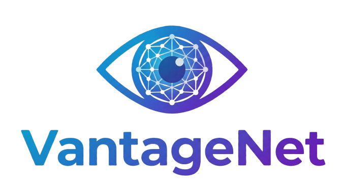
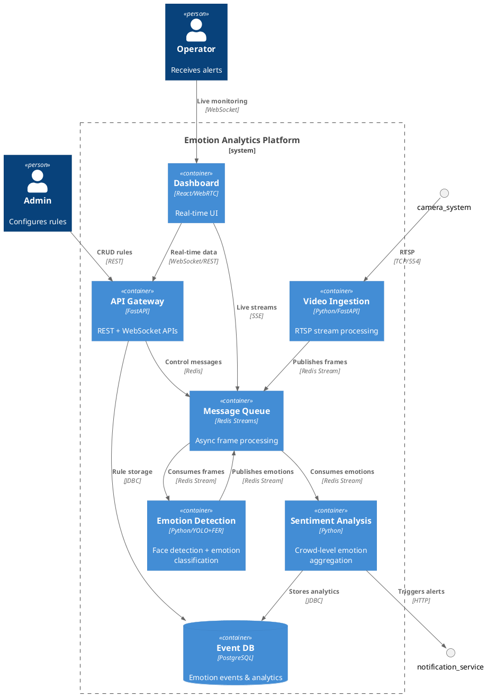

<p align="center">
  
</p>

<h1 align="center">VantageNet</h1>

<p align="center">
  <strong>Real-Time Crowd Emotion Analytics Platform</strong>
</p>

<p align="center">
  
  
  
  
  
  
  
</p>

<p align="center">
  <a href="docs/SETUP.md">Setup Guide</a> •
  <a href="docs/ARCHITECTURE.md">Architecture</a> •
  <a href="docs/API.md">API Docs</a> •
  <a href="docs/DATABASE.md">Database</a>
</p>

---

## Overview

**VantageNet** is an enterprise-grade emotion analytics platform that processes live video streams to detect faces, analyze emotions, and aggregate crowd-level sentiment in real-time. Built with a microservices architecture, it provides actionable insights through an interactive dashboard.

### Key Features

- **Live Video Processing** — MJPEG streams with real-time emotion detection overlays
- **7-Emotion Detection** — Happy, Sad, Angry, Surprised, Fear, Disgust, Neutral
- **Crowd Sentiment Analytics** — Aggregated mood scores and trend analysis
- **Smart Alerting** — Configurable rules for emotion-based triggers
- **Interactive Dashboard** — Real-time charts with auto-refresh capabilities
- **WebSocket Streaming** — Live updates pushed to connected clients

---

## Architecture

<p align="center">
  
</p>

<p align="center">
  <em>C4 Container Diagram — System Architecture Overview</em>
</p>

---

## Quick Start

```bash
# Clone the repository
git clone https://github.com/7amo10/VantageNet.git
cd VantageNet

# Start infrastructure (PostgreSQL, Redis, API Gateway)
docker compose up -d postgres redis api-gateway

# Set up Python environment
python -m venv my_env && source my_env/bin/activate
pip install -r services/emotion-detection/requirements.txt
pip install -r services/sentiment-analysis/requirements.txt
pip install -r services/video-ingestion/requirements.txt

# Start services (in separate terminals)
cd services/video-ingestion && python -m app.main      # Terminal 1
cd services/emotion-detection && python -m app.main   # Terminal 2
cd services/sentiment-analysis && python -m app.main  # Terminal 3

# Start dashboard
cd services/dashboard && npm install && npm run dev   # Terminal 4
```

For detailed setup instructions, see **[docs/SETUP.md](docs/SETUP.md)**

---

## Service Endpoints

| Service | Port | Description |
|---------|------|-------------|
| Dashboard | 3001 | React/Next.js Web UI |
| API Gateway | 8000 | REST & WebSocket API |
| Video Ingestion | 8001 | RTSP/Webcam Processing |
| Emotion Detection | 8002 | Face & Emotion ML |
| Sentiment Analysis | 8003 | Crowd Aggregation |
| PostgreSQL | 5434 | Analytics Database |
| Redis | 6380 | Stream Processing |

---

## Documentation

| Document | Description |
|----------|-------------|
| [**SETUP.md**](docs/SETUP.md) | Complete installation and configuration guide |
| [**ARCHITECTURE.md**](docs/ARCHITECTURE.md) | System design and component overview |
| [**API.md**](docs/API.md) | REST API and WebSocket endpoints |
| [**DATABASE.md**](docs/DATABASE.md) | PostgreSQL schema and queries |
| [**PERFORMANCE.md**](docs/PERFORMANCE.md) | Optimization and benchmarks |
| [**redis-streams.md**](docs/redis-streams.md) | Redis streaming architecture |

---

## License

This project is licensed under the MIT License - see the [LICENSE](LICENSE) file for details.

---

<p align="center">
  <sub>Built for real-time emotion analytics</sub>
</p>
